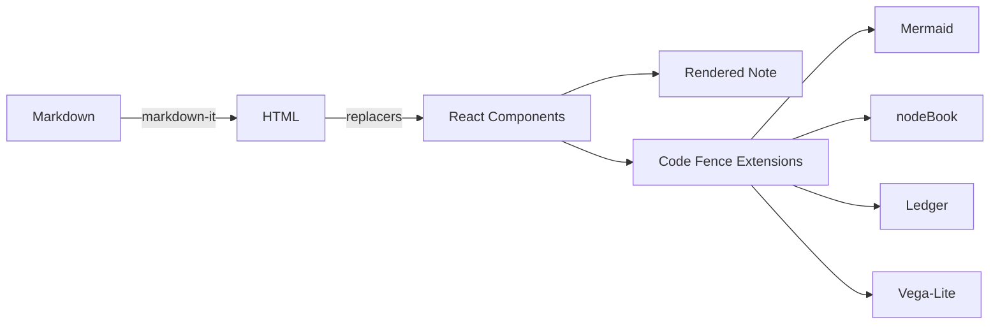
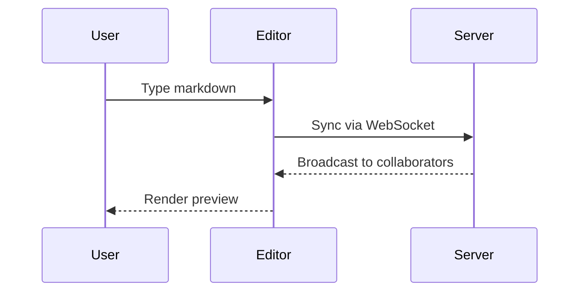
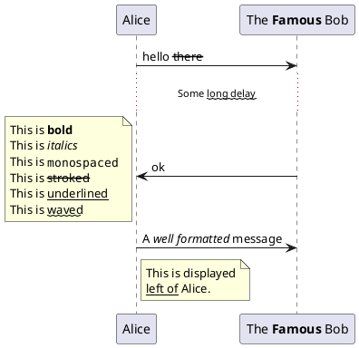

# HedgeDoc Features Demo

Welcome to **HedgeDoc** — a real-time collaborative markdown editor. This note showcases the features available in this instance, including the [nodeBook and Ledger extensions](/n/nodeBook).

[TOC]

## Text Formatting

You can write **bold**, *italic*, ~~strikethrough~~, and `inline code`.

Combined: ***bold italic***, **~~bold strikethrough~~**

> This is a blockquote. Use it to highlight important information or quotes.
> [color=blue]

:::info
This is an info admonition.
:::

:::warning
This is a warning admonition.
:::

:::success
This is a success admonition.
:::

## Lists

### Unordered
- First item
- Second item
  - Nested item
  - Another nested item
- Third item

### Ordered
1. Step one
2. Step two
3. Step three

### Task Lists
- [x] Learn markdown basics
- [x] Try HedgeDoc
- [ ] Explore the [nodeBook and Ledger extensions](/n/nodeBook)
- [ ] Collaborate with others

## Links & References

- [nodeBook — Knowledge Graphs & Ledger](/n/nodeBook) — interactive CNL graphs and personal accounting
- [HedgeDoc Documentation](https://docs.hedgedoc.org)

## Tables

| Element | Symbol | Atomic Number | State |
|---------|--------|:-------------:|------:|
| Hydrogen | H | 1 | Gas |
| Helium | He | 2 | Gas |
| Lithium | Li | 3 | Solid |
| Carbon | C | 6 | Solid |
| Oxygen | O | 8 | Gas |

## Math (KaTeX)

You can render *LaTeX* mathematical expressions using **KaTeX**.

Inline math: The *Gamma function* satisfying $\Gamma(n) = (n-1)!\quad\forall n\in\mathbb N$ is via the Euler integral.

Block math — the quadratic formula:

$$
x = {-b \pm \sqrt{b^2-4ac} \over 2a}
$$

The Gamma function:

$$
\Gamma(z) = \int_0^\infty t^{z-1}e^{-t}dt
$$

The Gaussian integral:

$$
\int_{-\infty}^{\infty} e^{-x^2} dx = \sqrt{\pi}
$$

> More information about **LaTeX** mathematical expressions [here](https://katex.org/docs/supported).

## Code Highlighting

```javascript
function greet(name) {
  return `Hello, ${name}! Welcome to HedgeDoc.`;
}

console.log(greet('World'));
```

```python
def fibonacci(n):
    a, b = 0, 1
    for _ in range(n):
        yield a
        a, b = b, a + b

print(list(fibonacci(10)))
```

```bash
# Deploy with Docker
docker compose up -d
curl -s https://localhost/api/health
```

## Mermaid Diagrams





## PlantUML



## Vega-Lite Charts

```vega-lite
{
  "$schema": "https://vega.github.io/schema/vega-lite/v5.json",
  "width": "container",
  "height": 200,
  "data": {
    "values": [
      {"language": "JavaScript", "users": 17400000},
      {"language": "Python", "users": 15700000},
      {"language": "Java", "users": 12200000},
      {"language": "TypeScript", "users": 9800000},
      {"language": "C#", "users": 7500000},
      {"language": "Rust", "users": 3500000}
    ]
  },
  "mark": "bar",
  "encoding": {
    "x": {"field": "users", "type": "quantitative", "title": "Developers"},
    "y": {"field": "language", "type": "nominal", "sort": "-x", "title": null},
    "color": {"field": "language", "type": "nominal", "legend": null}
  }
}
```

## Flowchart.js

```flow
st=>start: Start
op=>operation: Your Operation
cond=>condition: Yes or No?
e=>end

st->op->cond
cond(yes)->e
cond(no)->op
```

## ABC Music Notation

```abc
X:1
T:Speed the Plough
M:4/4
C:Trad.
K:G
|:GABc dedB|dedB dedB|c2ec B2dB|A2A2 A2BA|
GABc dedB|dedB dedB|c2ec B2dB|A2A2 G4:|
```

## Embedding

### YouTube
https://www.youtube.com/watch?v=YE7VzlLtp-4

### Vimeo
https://vimeo.com/23237102

### Gist
https://gist.github.com/schacon/1

## nodeBook & Ledger Extensions

This instance of HedgeDoc includes two additional code fence extensions:

| Extension | Code Fence | Purpose |
|-----------|-----------|---------|
| **nodeBook** | ` ```nodeBook ` | Knowledge graphs using Controlled Natural Language |
| **Ledger** | ` ```ledger ` | Personal accounting with auto-computed reports and charts |

See the full documentation and live examples at [/n/nodeBook](/n/nodeBook).

### Quick nodeBook Example

```nodeBook
# HedgeDoc [Software]
<is a> Collaborative Editor;
<supports> Markdown;
<supports> Code Fence Extensions;

# Markdown [Format]
<renders as> HTML;

# Code Fence Extensions [Feature]
<includes> Mermaid;
<includes> Vega-Lite;
<includes> nodeBook;
<includes> Ledger;
```

### Quick Ledger Example

```ledger
@account Wallet 100.00

| Date | Description | Amount | Account | Tags |
|------|-------------|--------|---------|------|
| 2024-01-15 | Lunch    | -12.50 | Wallet | #food      |
| 2024-01-15 | Coffee   |  -4.00 | Wallet | #food      |
| 2024-01-16 | Bus Pass | -25.00 | Wallet | #transport |

---
balance
summary #food #transport
chart pie categories
```

## Images

You can drag and drop images directly into the editor, or use standard markdown image syntax.

## Real-time Collaboration

HedgeDoc supports real-time collaborative editing. Share the URL of any note and edit together with others simultaneously. Changes sync instantly via WebSocket.

---

*This is a demo note. Edit it freely or [create your own notes](/new)!*
